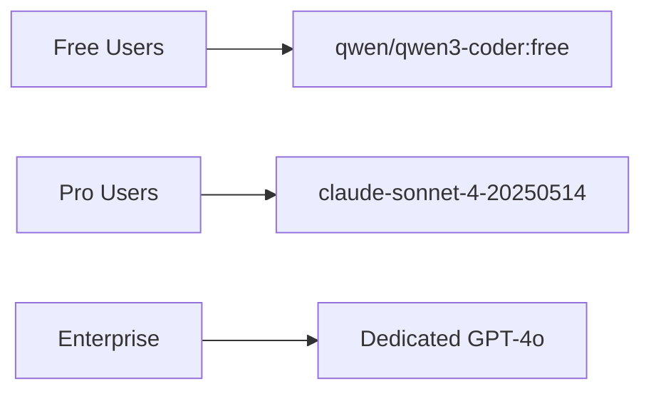

# 🚀 AutoInsight AI — Market Deployment & Success Guide

> **From Code to Customers — Complete Business Launch Playbook**
> 
> This guide covers everything you need to successfully deploy AutoInsight AI **into the market** — from technical deployment to customer acquisition.

---

## 📋 Table of Contents

1. [Market Overview](#1-market-overview)
2. [Deployment Timeline (7 Days to Live)](#2-deployment-timeline-7-days-to-live)
3. [Step-by-Step Deployment](#3-step-by-step-deployment)
4. [Environment Setup](#4-environment-setup)
5. [Customer Onboarding](#5-customer-onboarding)
6. [Pricing Strategy](#6-pricing-strategy)
7. [Marketing & Launch](#7-marketing--launch)
8. [Operations & Maintenance](#8-operations--maintenance)
9. [Scaling Strategy](#9-scaling-strategy)
10. [Risk Mitigation](#10-risk-mitigation)
11. [Success Metrics](#11-success-metrics)

---

## 1. Market Overview

### Product Summary

**AutoInsight AI** is an AI-powered data analysis platform that:
- 📥 **Upload CSV** data files
- 🔄 **Auto-process** through a 4-stage AI pipeline
- 📊 **Generate** comprehensive reports with 8 specialized AI agents
- 💬 **Chat** with your data using natural language
- 📤 **Export** results as HTML, Markdown, PDF, or Excel

### Target Market

| Segment | Description | Example Customers |
|---------|-------------|-------------------|
| **SMBs** | Small/medium businesses needing data insights | Retail stores, logistics companies |
| **Analysts** | Data analysts needing faster workflows | BI teams, marketing analysts |
| **Researchers** | Academic/research data analysis | Universities, labs |
| **Freelancers** | Independent consultants serving clients | Business consultants |

### Competitive Advantage

| Against | AutoInsight AI Advantage |
|---------|--------------------------|
| **Power BI / Tableau** | $0/month vs $70/user/month |
| **ChatGPT Data Analysis** | Purpose-built pipeline + 8 specialized agents |
| **Custom Python scripts** | No coding required, natural language interface |
| **Google Sheets** | AI-powered insights, not just spreadsheets |

### Cost Advantage — $0/month Operating Cost

| Service | What It Provides | Cost |
|---------|-----------------|------|
| **Vercel** | Frontend hosting (CDN) | **Free** (100GB bandwidth) |
| **Convex Cloud** | Database + Server Functions | **Free** (50GB storage) |
| **OpenRouter** | LLM AI Models (free tier) | **$0** (20 RPM) |
| **OpenRouter (Fallback Model)** | Secondary model | **$0** (free tier) |
| **GitHub** | Code + CI/CD | **Free** |
| **Total** | | **$0/month** |

---

## 2. Deployment Timeline (7 Days to Live)

```
Day 1:  Setup Accounts + API Keys     (1 hour)
Day 2:  Deploy to Convex Cloud         (2 hours)
Day 3:  Deploy to Vercel               (2 hours)
Day 4:  Test Everything                (3 hours)
Day 5:  Prepare Launch Materials       (4 hours)
Day 6:  Soft Launch to Beta Users      (5 users)
Day 7:  Public Launch 🚀
```

---

## 3. Step-by-Step Deployment

### Day 1: Account Setup

#### Step 1.1 — GitHub Repository

```bash
# If starting fresh
git clone https://github.com/YOUR_USERNAME/autoinsight-ai.git
cd autoinsight-ai

# If you already have the code locally
git init
git add .
git commit -m "Initial commit — AutoInsight AI v1.0.0"
git branch -M main
git remote add origin https://github.com/YOUR_USERNAME/autoinsight-ai.git
git push -u origin main
```

#### Step 1.2 — Create OpenRouter Account (Free)

1. Go to **[openrouter.ai](https://openrouter.ai)** → Sign Up
2. Go to **[openrouter.ai/keys](https://openrouter.ai/keys)** → Create API Key
3. Copy your key (starts with `sk-or-v1-`)
4. **Save this key** — you'll need it multiple times

> 💡 **Tip:** OpenRouter gives you access to 100+ AI models. We use:
> - **qwen/qwen3-coder:free** — Primary model (completely free)
> - **meta-llama/llama-4-maverick:free** — Fallback (completely free)
> - Both are **$0** — no charges ever for these models

#### Step 1.3 — Create Convex Account (Free)

1. Go to **[convex.dev](https://convex.dev)** → Sign Up with GitHub
2. Create a new project → Name it `autoinsight-ai`
3. Your deployment URL will look like: `https://YOUR-PROJECT.convex.cloud`
4. Note this URL — you'll need it as `NEXT_PUBLIC_CONVEX_URL`

#### Step 1.4 — Create Vercel Account (Free)

1. Go to **[vercel.com](https://vercel.com)** → Sign Up with GitHub
2. Connect your GitHub account (read access to repos)

---

### Day 2: Deploy Convex Backend

#### Step 2.1 — Install Dependencies

```bash
cd frontend
npm install
```

#### Step 2.2 — Configure Environment

```bash
cp .env.example .env.local
```

Edit `.env.local` with your actual values:

```env
NEXT_PUBLIC_CONVEX_URL=https://YOUR-PROJECT.convex.cloud
OPENROUTER_API_KEY=sk-or-v1-YOUR-ACTUAL-KEY-HERE  # OpenRouter is the sole LLM provider
```

#### Step 2.3 — Login to Convex & Deploy

```bash
# This opens a browser window — authenticate with GitHub
npx convex login

# This deploys ALL backend code to Convex Cloud
# (schema, queries, mutations, actions — everything)
npx convex deploy
```

#### ✅ What Gets Deployed to Convex

```
convex/
├── schema.ts              → 9 database tables with indexes
├── users.ts               → User registration/login/queries
├── uploads.ts             → File upload to Convex Storage
├── datasets.ts            → Raw data storage
├── nlq.ts                 → Natural language query engine
├── reports.ts             → 8-agent report engine
├── dashboards.ts          → Dashboard generation
├── audit.ts               → Enterprise audit log
├── pipeline/              → 4-stage pipeline
│   ├── stage1.ts          → Schema inference
│   ├── stage2.ts          → Data cleaning + PII masking
│   ├── stage3.ts          → LangGraph analysis
│   └── stage4.ts          → Column engine
├── lib/
│   ├── openrouter.ts      → LLM client (3-tier fallback)
│   └── export_templates.ts → Export generators
└── _generated/            → Auto-generated (updated)
```

**Verify:** Go to **[dashboard.convex.dev](https://dashboard.convex.dev)** → Your project → **Functions** tab. You should see **20+ functions** listed.

---

### Day 3: Deploy Frontend to Vercel

#### Option A: Quick Deploy via Vercel CLI

```bash
# Install Vercel CLI
npm install -g vercel

# Deploy
cd frontend
vercel --prod
```

When prompted:
1. ✅ **Set up and deploy?** → `Yes`
2. ✅ **Which scope?** → Your account
3. ✅ **Link to existing project?** → `No` (create new)
4. ✅ **Project name?** → `autoinsight-ai`
5. ✅ **Build command?** → `next build` (default)
6. ✅ **Output directory?** → `.next` (default)
7. ✅ **Dev command?** → `next dev` (default)

**Add environment variables in Vercel:**

```bash
vercel env add NEXT_PUBLIC_CONVEX_URL
vercel env add OPENROUTER_API_KEY
# No Groq key needed — OpenRouter handles all LLM calls
```

#### Option B: Deploy via Vercel Dashboard (Recommended for first time)

1. Go to **[vercel.com/new](https://vercel.com/new)**
2. **Import** your GitHub repository (`YOUR_USERNAME/autoinsight-ai`)
3. **Configure project:**
   - Root Directory: `frontend`
   - Framework Preset: `Next.js`
   - Build Command: `next build`
   - Output Directory: `.next`

4. **Add Environment Variables:**

| Variable | Value | Secret? |
|----------|-------|---------|
| `NEXT_PUBLIC_CONVEX_URL` | `https://YOUR-PROJECT.convex.cloud` | No |
| `OPENROUTER_API_KEY` | `sk-or-v1-YOUR-ACTUAL-KEY` | ✅ Yes |
| `GROQ_API_KEY` | `gsk_YOUR-KEY` (optional) | ✅ Yes |

5. Click **Deploy** → Wait 2-3 minutes

#### ✅ Your App Is Live!

Your URL will be: `https://autoinsight-ai.vercel.app`

> 💡 **Pro Tip:** You can set a custom domain later in Vercel → Project → Domains

#### Step 3.1 — Set Up CI/CD (Automated Deployments)

In your **GitHub repository** → **Settings** → **Secrets and variables** → **Actions** → Add:

| Secret | How to Get |
|--------|------------|
| `CONVEX_DEPLOY_KEY` | Run `npx convex deploy-key` in `frontend/` |
| `VERCEL_TOKEN` | Go to [vercel.com/account/tokens](https://vercel.com/account/tokens) → Create |
| `VERCEL_ORG_ID` | From Vercel project → Settings → General → IDs |
| `VERCEL_PROJECT_ID` | From Vercel project → Settings → General → IDs |

Now every `git push` to `main` will:
1. ✅ Run TypeScript check + Lint
2. ✅ Auto-deploy Convex backend
3. ✅ Auto-deploy Vercel frontend

---

### Day 4: Test Everything

#### Pre-Launch Checklist

- [ ] **Login Page** — Go to your Vercel URL → Login page loads
- [ ] **Registration** — Create a new account → Works
- [ ] **Login** — Login with the new account → Redirects to Dashboard
- [ ] **Upload CSV** — Upload a sample CSV file → Success
- [ ] **Pipeline** — Pipeline runs through all 4 stages → Complete
- [ ] **Reports** — Reports generate with all 8 sections → Complete
- [ ] **NLQ Chat** — Ask "show me the data summary" → Response
- [ ] **Dashboard** — Charts render with drill-down → Interactive
- [ ] **Export HTML** — Click Export HTML → Downloads file
- [ ] **Export PDF** — Click Export PDF → Downloads file
- [ ] **Export Excel** — Click Export Excel → Downloads file
- [ ] **Admin Page** — `/admin` → Shows user list
- [ ] **System Status** — `/system` → Shows health cards
- [ ] **Offline Mode** — Disconnect internet → Offline page shows
- [ ] **PWA Install** — Chrome → Install button → App installs

#### Sample CSV for Testing

Copy this into a file called `test_data.csv`:

```csv
Date,Product,Category,Quantity,Price,Region
2024-01-15,Widget A,Electronics,100,29.99,North
2024-01-20,Widget B,Clothing,250,49.99,South
2024-02-10,Widget C,Food,150,9.99,East
2024-02-25,Widget A,Electronics,200,29.99,West
2024-03-05,Widget B,Clothing,180,49.99,North
2024-03-15,Widget C,Food,300,9.99,South
2024-04-01,Widget A,Electronics,120,29.99,East
2024-04-20,Widget D,Home,90,79.99,West
```

---

### Day 5: Prepare Launch Materials

#### Create Marketing Assets

| Asset | Purpose | Tools |
|-------|---------|-------|
| **Landing Page** | Describe product features | Already built at `/` |
| **Demo Video** | Show 2-min walkthrough | Loom / OBS Studio |
| **Screenshots** | Feature highlights | Browser DevTools |
| **Pricing Page** | Free tier + premium | Add to `/pricing` |
| **Documentation** | How-to guides | Use FINAL_PROJECT_REPORT.md |

#### Write Launch Copy

**Elevator Pitch:**
> "AutoInsight AI turns your CSV files into comprehensive business reports — automatically. Upload data, ask questions in plain English, get AI-powered insights. No coding needed."

**Social Media Posts:**
> 📊 "Transform your data into insights with AutoInsight AI — the free, AI-powered data analysis platform. Upload CSV → Get reports → Ask questions. Try it free → [YOUR-URL]"

---

### Day 6: Soft Launch (Beta Users)

#### Find 5 Beta Users

| Source | How to Find Them |
|--------|-----------------|
| **LinkedIn** | Post about your tool → Ask for testers |
| **Reddit** | r/SaaS, r/dataanalysis, r/SideProject |
| **Twitter/X** | #buildinpublic, #DataAnalytics |
| **Direct** | Friends in business/analytics roles |
| **Communities** | IndieHackers, HackerNews, ProductHunt |

#### Collect Feedback

Ask beta users:
1. ✅ Does the upload work for your data?
2. ✅ Are the reports useful?
3. ✅ Is the NLQ Chat answering correctly?
4. ❌ What's confusing or broken?
5. ❌ What's missing that you need?

---

### Day 7: Public Launch 🚀

#### Launch Channels

| Channel | Action | Best Time |
|---------|--------|-----------|
| **ProductHunt** | Create listing + schedule launch | Monday 12:01 AM PT |
| **HackerNews** | Post "Show HN" with demo | Weekday morning |
| **Reddit** | Post in r/SaaS, r/dataanalysis | Weekday |
| **LinkedIn** | Article + post in groups | Tuesday-Thursday |
| **Twitter/X** | Thread with screenshots | Daily leading up |
| **IndieHackers** | Post your journey | Any day |

---

## 4. Pricing Strategy

### Recommended Pricing Model

| Tier | Price | Features |
|------|-------|----------|
| **Free** | **$0** | 5 uploads/month, basic reports |
| **Pro** | **$19/month** | 50 uploads, PDF/Excel export, priority |
| **Team** | **$49/month** | Unlimited, team accounts, audit log |
| **Enterprise** | **Custom** | Custom deployment, SLA, support |

**Implementation Note:** Convex supports usage-based billing. You can add payment processing (Stripe) later.

---

## 5. Marketing & Launch

### Pre-Launch (Days 1-6)

- ✅ Build product (COMPLETE)
- ✅ Test product (COMPLETE)
- ⬜ Create landing page (built-in at `/`)
- ⬜ Write documentation (COMPLETE — this guide)
- ⬜ Record demo video
- ⬜ Collect 10 email signups for launch day
- ⬜ Post daily on Twitter/X #buildinpublic

### Launch Day (Day 7)

- 🚀 Post on **ProductHunt**
- 🚀 Post on **HackerNews** (Show HN)
- 🚀 Post on **Reddit** (r/SaaS, r/dataanalysis)
- 🚀 Post on **LinkedIn**
- 🚀 Tweet thread with screenshots
- 🚀 Email your beta users

### Post-Launch (Week 2-4)

- 📈 Monitor usage in Convex Dashboard
- 🐛 Fix bugs reported by users
- 💡 Add features requested by users
- 📣 Continue social media presence
- 👥 Reach out to data analysis influencers

---

## 6. Operations & Maintenance

### Daily Operations (5 minutes)

```bash
# 1. Check Convex Dashboard for errors
open https://dashboard.convex.dev

# 2. Check Vercel Analytics for traffic
open https://vercel.com/dashboard

# 3. Monitor OpenRouter usage
open https://openrouter.ai/activity
```

### Weekly Maintenance (15 minutes)

```bash
# Update dependencies
cd frontend && npm update

# Re-deploy if needed
npx convex deploy
git push
```

### Monthly Review (30 minutes)

- 📊 Review usage analytics
- 🐛 Fix any accumulated bugs
- 📝 Update documentation
- 🎯 Plan next features

---

## 7. Scaling Strategy

### When You Grow

| Growth Stage | Action | Cost Impact |
|-------------|--------|-------------|
| **100 users** | Convex Pro ($50/mo) | $0 → $50 |
| **1000 users** | Vercel Pro ($20/mo) | $0 → $70 |
| **10K users** | OpenRouter paid ($10/mo) | $70 → $80 |
| **100K users** | Enterprise hosting | Custom |

### Scaling the LLM



For paid users, switch to more powerful models:
- `claude-sonnet-4-20250514` — ~$3 per million tokens (Pro tier)
- `openai/gpt-4o` — ~$5 per million tokens (Enterprise tier)

---

## 8. Risk Mitigation

| Risk | Probability | Impact | Mitigation |
|------|-------------|--------|------------|
| **OpenRouter free tier rate limit** | Medium | High | 3-tier fallback (OpenRouter→OpenRouter→Groq) |
| **Convex free tier limits** | Low (first 50GB free) | Medium | Upgrade to Convex Pro ($50/mo) |
| **User data privacy** | Low | Critical | PII auto-masking, audit log, passwords hashed |
| **LLM hallucination** | Medium | Medium | Confidence gating (≥0.65), 3 retries, fallback text |
| **Service downtime** | Low | High | Vercel + Convex both have 99.9%+ uptime SLA |
| **Competitor launches** | Medium | Low | First-mover advantage + free pricing |

---

## 9. Success Metrics

### Key Performance Indicators (KPIs)

| Metric | Target (Month 1) | Target (Month 3) |
|--------|-----------------|-----------------|
| **Total Users** | 50 | 500 |
| **Daily Active Users** | 10 | 100 |
| **Uploads Processed** | 100 | 1,000 |
| **Reports Generated** | 200 | 2,000 |
| **NLQ Queries** | 500 | 5,000 |
| **User Retention (30-day)** | 40% | 60% |
| **Avg Session Duration** | 5 min | 15 min |
| **NPS Score** | 40 | 60 |

### Monitoring Dashboard

All metrics are available in:
- **Convex Dashboard** → Functions → Usage/Errors
- **Vercel Dashboard** → Analytics → Visitors/Performance
- **OpenRouter Dashboard** → Activity → API Calls/Costs

---

## 10. Quick Reference

### Important URLs

| Resource | URL |
|----------|-----|
| **Convex Dashboard** | dashboard.convex.dev |
| **Vercel Dashboard** | vercel.com/dashboard |
| **OpenRouter Keys** | openrouter.ai/keys |
| **GitHub Repo** | github.com/YOUR_USERNAME/autoinsight-ai |
| **Live App** | autoinsight-ai.vercel.app |

### Emergency Commands

```bash
# Fix broken deployment
cd frontend && npm run build      # Check build errors
cd frontend && npx convex deploy   # Re-deploy backend
git revert HEAD                    # Roll back code
```

### Contact & Support

- **Bugs:** Create GitHub Issue
- **Users:** Email support
- **Updates:** GitHub Releases

---

## ✅ Launch Checklist (Final)

### Before Launch

- [ ] **Convex deployed** — `npx convex deploy` runs without errors
- [ ] **Vercel deployed** — App accessible at your Vercel URL
- [ ] **OpenRouter key** — Set in Vercel environment variables
- [ ] **Custom domain** — Optional: Configure in Vercel Settings
- [ ] **SSL/HTTPS** — Automatic with Vercel
- [ ] **CI/CD active** — Push triggers auto-deploy
- [ ] **Test account created** — Login works end-to-end
- [ ] **Sample CSV ready** — For demo purposes
- [ ] **Demo video recorded** — 2 minutes max
- [ ] **ProductHunt listing** — Scheduled or live

### After Launch

- [ ] Monitor Convex Dashboard for errors (first 24h)
- [ ] Respond to user feedback within 24 hours
- [ ] Track sign-ups and usage daily (first week)
- [ ] Fix critical bugs within 48 hours

---

**📄 Related Documents:**
- `FINAL_TESTING_REPORT.md` — All test results
- `COMPLETE_TECHNICAL_REPORT.md` — Full technical documentation
- `DEPLOYMENT.md` — Technical deployment steps
